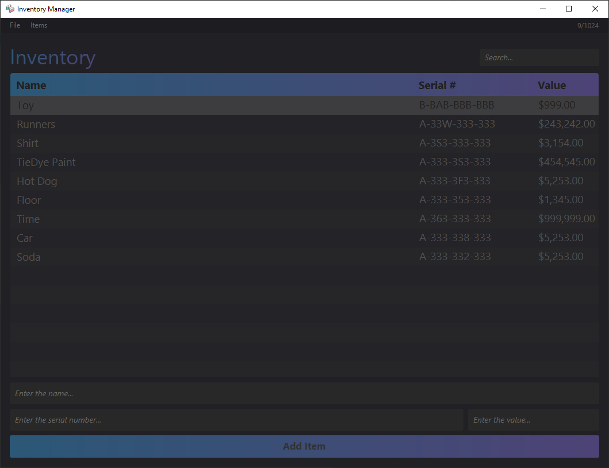
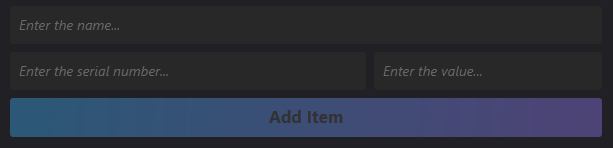
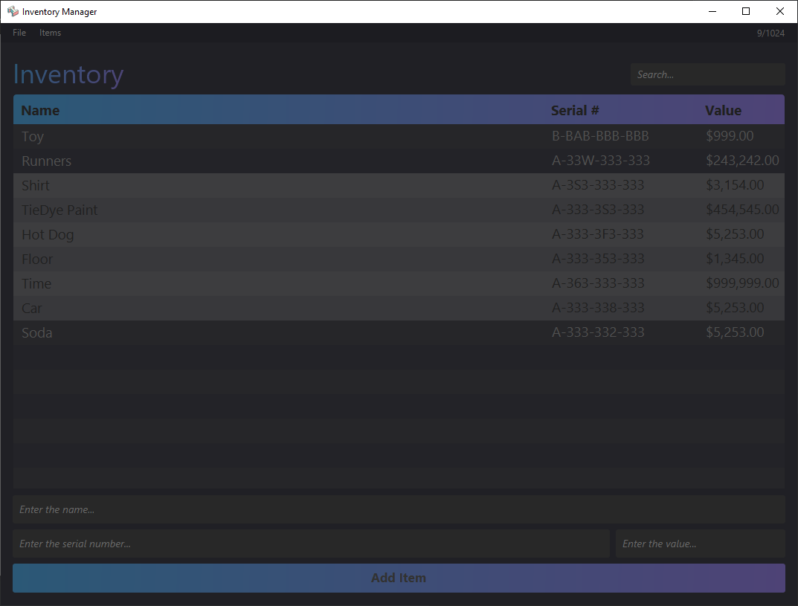
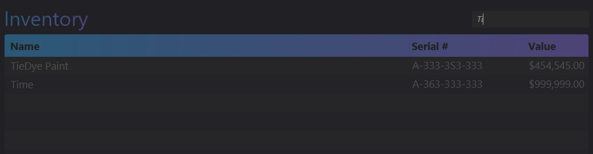
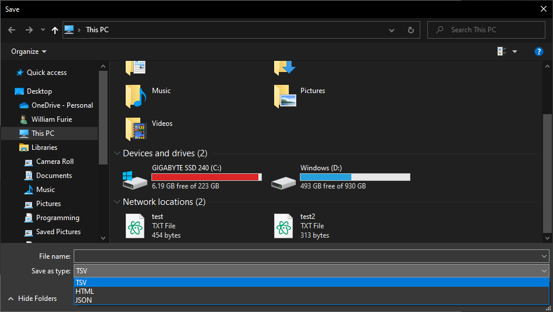
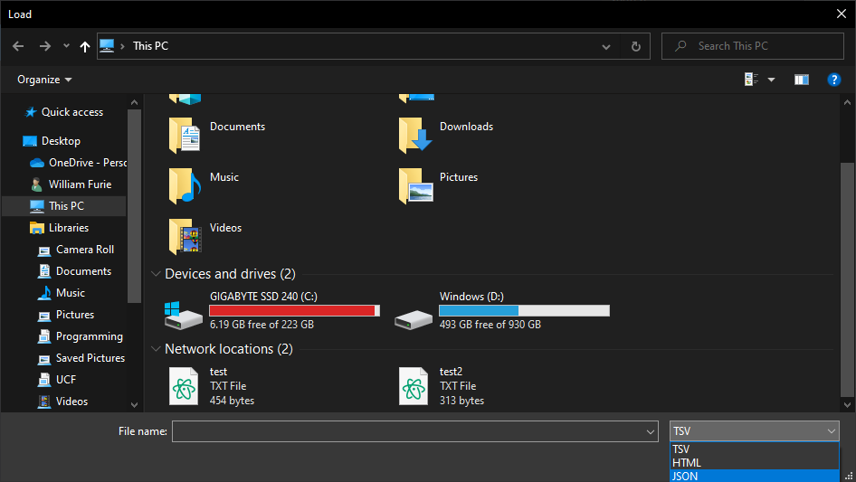

<!-- PROJECT LOGO -->
 

  

<h3 align="center">Inventory Management Application</h3>

  

    GUI desktop application that allows a user to manage items in an inventory.
     
  

  

    https://www.linkedin.com/in/furie/
  

<!-- ABOUT THE PROJECT -->
## About The Project

 

 
Project worked on in Fall 2021 for my Object Oriented Programming Class

(<a href="#top">back to top</a>)

### Built With

* [JavaFX](https://openjfx.io/)
* [Scene Builder](https://gluonhq.com/products/scene-builder/)

(<a href="#top">back to top</a>)

## User Guide

<!-- USAGE EXAMPLES -->

  
Table of Contents

  <ul>
    <li><a href="#Creating-an-Inventory">Creating an Inventory</a></li>
    <li><a href="#Adding-Items-to-Inventory">Adding Items to Inventory</a></li>
    <li><a href="#Removing-Items-from-Inventory">Removing Items from Inventory</a></li>
    <li><a href="#Editing-an-Item">Editing an Item</a></li>
    <li><a href="#Sorting-Inventory">Sorting Items in Inventory</a></li>
    <li><a href="#Searching-for-Items">Searching for Items in Inventory</a></li>
    <li><a href="#Saving-an-Inventory">Saving an Inventory</a></li>
    <li><a href="#Loading-an-Inventory">Loading an Inventory</a></li>
  </ul>

### Creating an Inventory
#### By default, when you launch the application, you will begin with a blank inventory.
If you want to manually create a new todo list, it can be found in the header menu. File -> Create New Inventory.
<!-- PICTURE HERE  -->
 

### Adding Items to Inventory
- An item **must** have a name of 2-256 characters (inclusive).
- An item **must** have a serial number. The serial number **must** be in the format A-XXX-XXX-XXX, where A is a letter, and X is a letter or digit.
  Serial numbers are not case-sensitive, so entering A-AAA-AAA-AAA is equivalent to a-aaa-aaa-aaa.
- An item **must** have a dollar value. This value must be greater than or equal to $0.

An item can be created by entering the name, the serial numbers, and the value in the Item Editor at the bottom section of the program.
- The user can either click the *Create Item* button with their mouse, or press *Enter* while in one of the text fields.

### Removing Items from Inventory

#### Removing Single Item
- Click on the item you want to remove to select it.
- In the header menu, go to Items -> remove selected.

#### Removing Multiple Items
- One way is to control click on the items you want to remove in the list to select them,
  then you go to the header menu, Items -> remove selected.
- Another way is to click one item, then shift click to select all the contained items, then repeat Items -> remove selected.
- _These selected items will be highlighted grey_

(<a href="#User-Guide">back to table of contents</a>)

### Editing an Item

#### Editing Name
- Double-click on the name of the item, and a text box will appear
- Type in the new name, remembering to input a valid name, and then press enter.

#### Editing Serial Number
- Double-click on the serial number of the item, and a text box will appear
- Type in the new serial number, remembering to input a valid serial number, and then press enter.
   

#### Editing Value
- Double-click on the value of the item, and a text box will appear
- Type in the new value, remembering to input a valid value, and then press enter.
   

### Sorting Inventory

#### Sorting by Name
- Click on Name column header, to toggle ascending sort, descending sort, and no sort.

#### Sorting by Serial Number
- Click on Serial Number column header, to toggle ascending sort, descending sort, and no sort.

#### Sorting by Value
- Click on Value column header, to toggle ascending sort, descending sort, and no sort.

### Searching for Items

#### Searching by Name
- Go to the search box and enter the name of the item

#### Searching by Serial Number
- Go to the search box and enter the serial number of the item

### Saving an Inventory
- In the header menu, go to File -> Save Inventory.
- Select which filetype you would like to save to (TSV, JSON, or HTML)
- Find a place on your computer to save the file.

(<a href="#User-Guide">back to table of contents</a>)

 

### Loading an Inventory
- In the header menu, go to File -> Load Inventory.
- Select which filetype you would like to load from (TSV, JSON, or HTML)
- Find a todo list that you have previously saved before.
- Load the file.

Save List                  |  Load List
:-------------------------:|:-------------------------:
         |  

 
 

(<a href="#top">back to top</a>)

<!-- ACKNOWLEDGMENTS -->
## Acknowledgments

* Dr. Hollander
* TA Who Grades This

(<a href="#top">back to top</a>)

